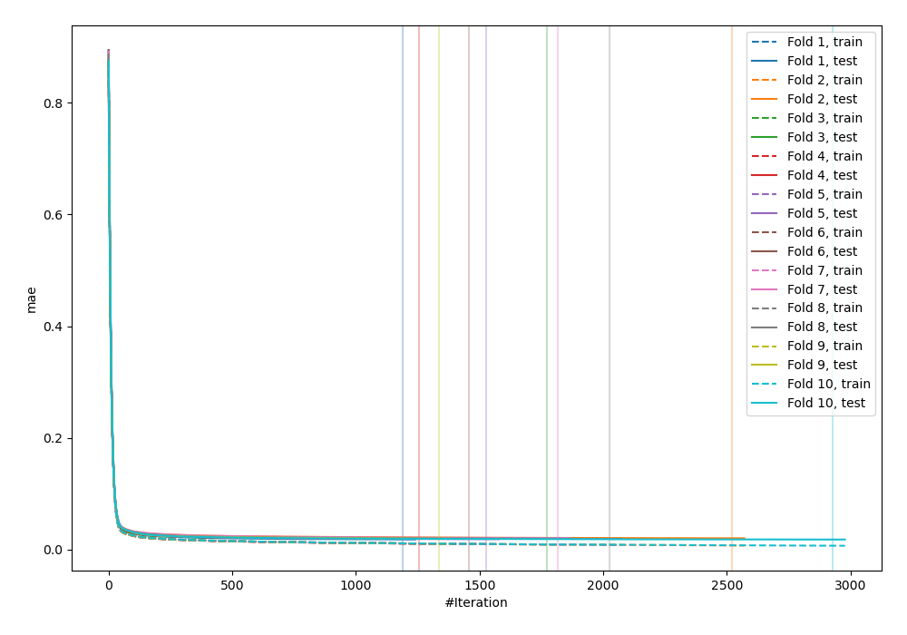
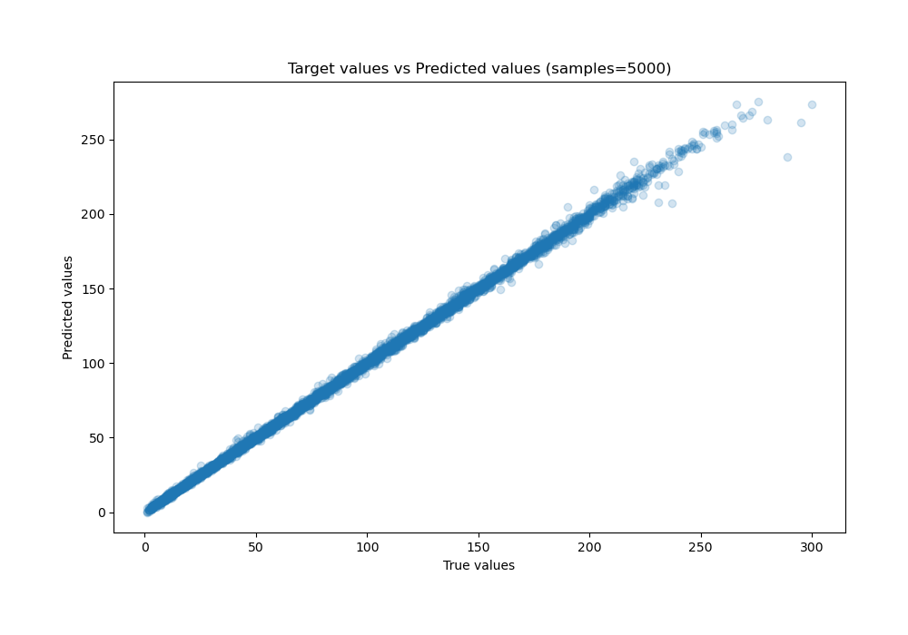
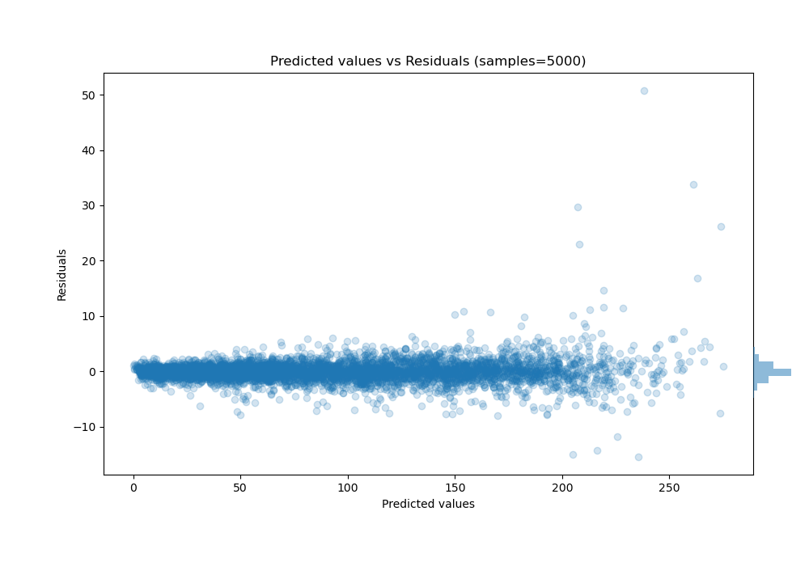

# Summary of 15_Xgboost

[<< Go back](../README.md)

## Extreme Gradient Boosting (Xgboost)
- **n_jobs**: -1
- **objective**: reg:squarederror
- **eta**: 0.1
- **max_depth**: 6
- **min_child_weight**: 50
- **subsample**: 0.9
- **colsample_bytree**: 0.7
- **eval_metric**: mae
- **explain_level**: 0

## Validation
 - **validation_type**: kfold
 - **shuffle**: True
 - **k_folds**: 10

## Optimized metric
mae

## Training time

46.1 seconds

### Metric details:
| Metric   |     Score |
|:---------|----------:|
| MAE      | 1.21924   |
| MSE      | 3.94698   |
| RMSE     | 1.9867    |
| R2       | 0.999     |
| MAPE     | 0.0233163 |

## Learning curves

## True vs Predicted

## Predicted vs Residuals

[<< Go back](../README.md)
