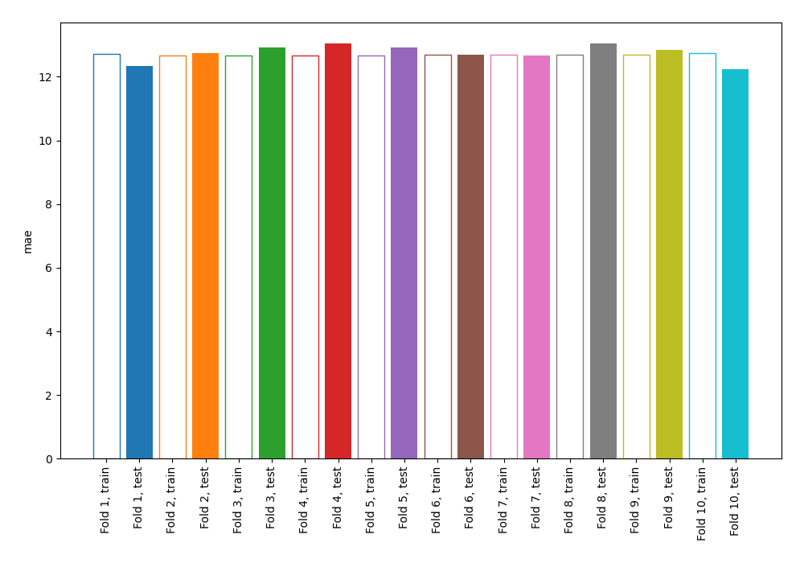
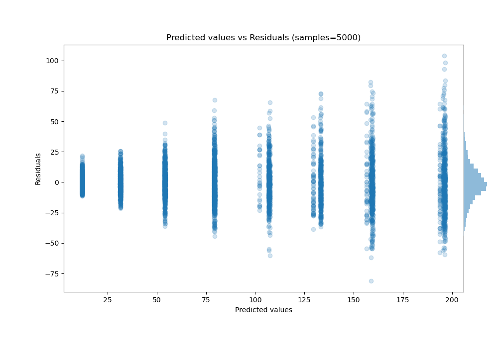

# Summary of 1_DecisionTree

[<< Go back](../README.md)

## Decision Tree
- **n_jobs**: -1
- **criterion**: squared_error
- **max_depth**: 3
- **explain_level**: 0

## Validation
 - **validation_type**: kfold
 - **shuffle**: True
 - **k_folds**: 10

## Optimized metric
mae

## Training time

3.2 seconds

### Metric details:
| Metric   |      Score |
|:---------|-----------:|
| MAE      |  12.7463   |
| MSE      | 308.023    |
| RMSE     |  17.5506   |
| R2       |   0.92193  |
| MAPE     |   0.256683 |

## Learning curves

## True vs Predicted

## Predicted vs Residuals

[<< Go back](../README.md)
