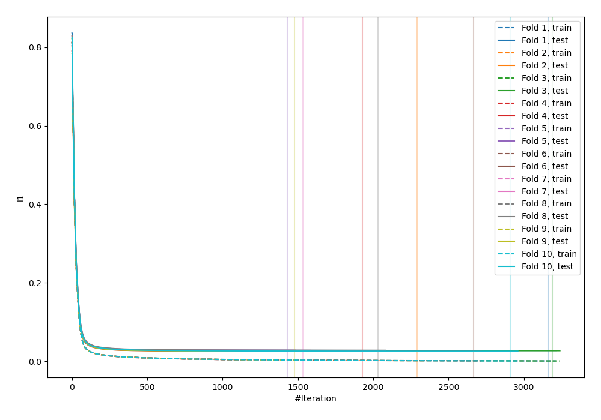
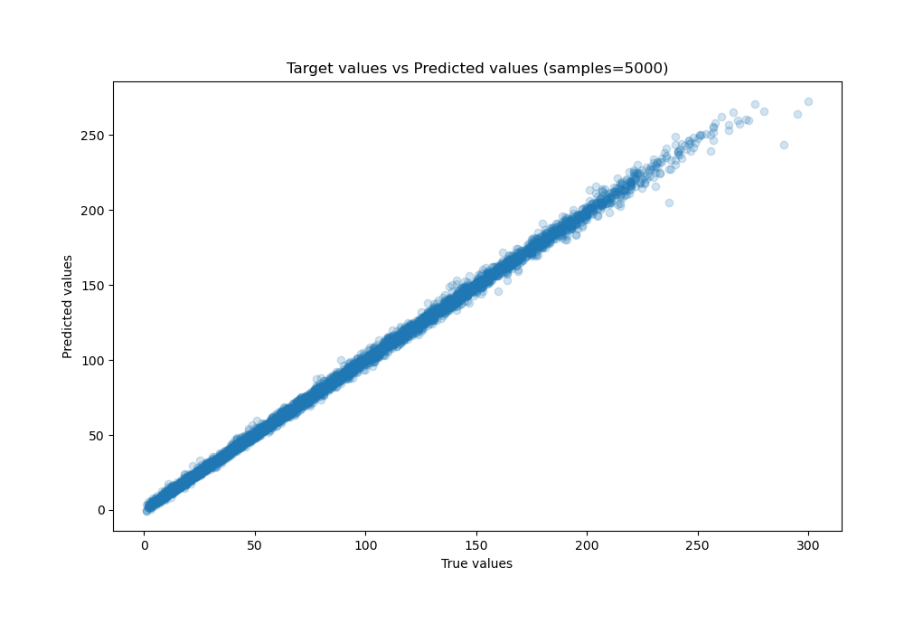
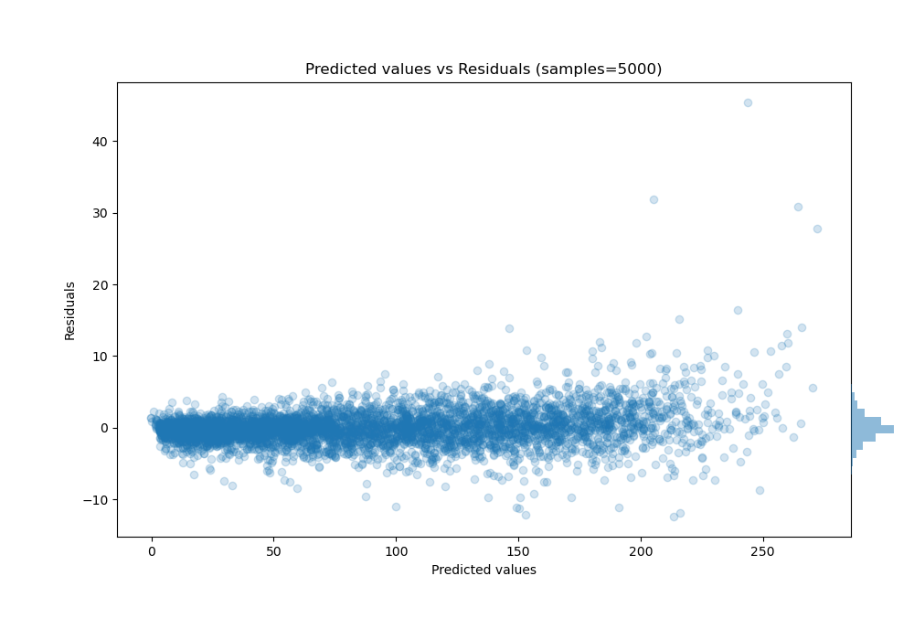

# Summary of 25_LightGBM

[<< Go back](../README.md)

## LightGBM
- **n_jobs**: -1
- **objective**: regression
- **num_leaves**: 127
- **learning_rate**: 0.05
- **feature_fraction**: 0.5
- **bagging_fraction**: 0.5
- **min_data_in_leaf**: 20
- **metric**: l1
- **custom_eval_metric_name**: None
- **explain_level**: 0

## Validation
 - **validation_type**: kfold
 - **shuffle**: True
 - **k_folds**: 10

## Optimized metric
mae

## Training time

145.5 seconds

### Metric details:
| Metric   |     Score |
|:---------|----------:|
| MAE      | 1.67031   |
| MSE      | 6.35146   |
| RMSE     | 2.52021   |
| R2       | 0.99839   |
| MAPE     | 0.0345055 |

## Learning curves

## True vs Predicted

## Predicted vs Residuals

[<< Go back](../README.md)
