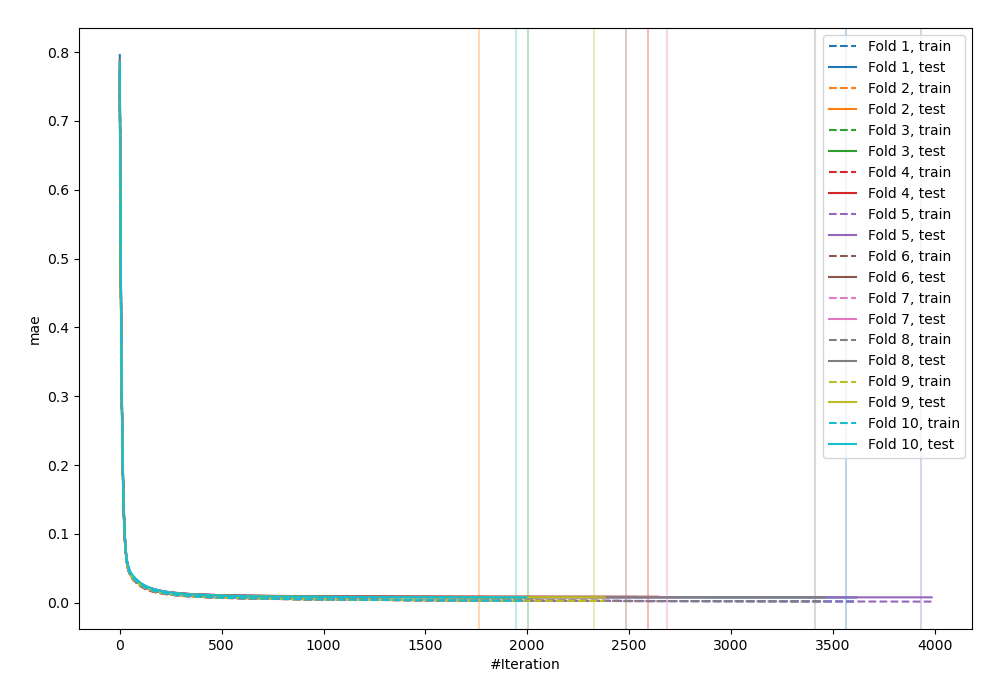
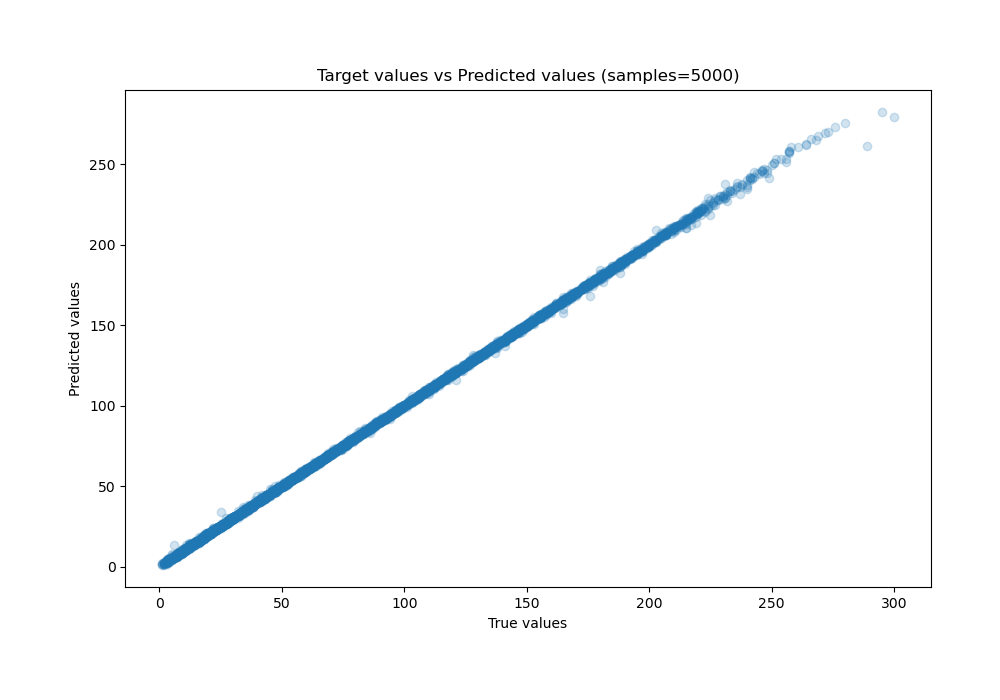
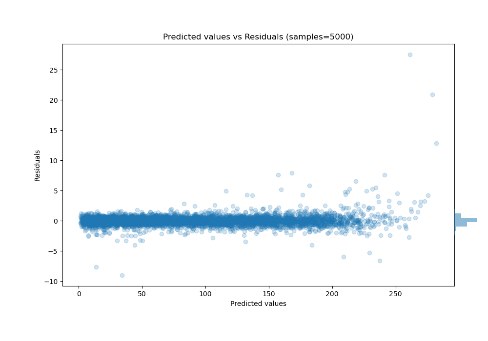

# Summary of 31_CatBoost

[<< Go back](../README.md)

## CatBoost
- **n_jobs**: -1
- **learning_rate**: 0.1
- **depth**: 7
- **rsm**: 1.0
- **loss_function**: RMSE
- **eval_metric**: MAE
- **explain_level**: 0

## Validation
 - **validation_type**: kfold
 - **shuffle**: True
 - **k_folds**: 10

## Optimized metric
mae

## Training time

92.7 seconds

### Metric details:
| Metric   |     Score |
|:---------|----------:|
| MAE      | 0.49707   |
| MSE      | 0.7336    |
| RMSE     | 0.856505  |
| R2       | 0.999814  |
| MAPE     | 0.0133147 |

## Learning curves

## True vs Predicted

## Predicted vs Residuals

[<< Go back](../README.md)
