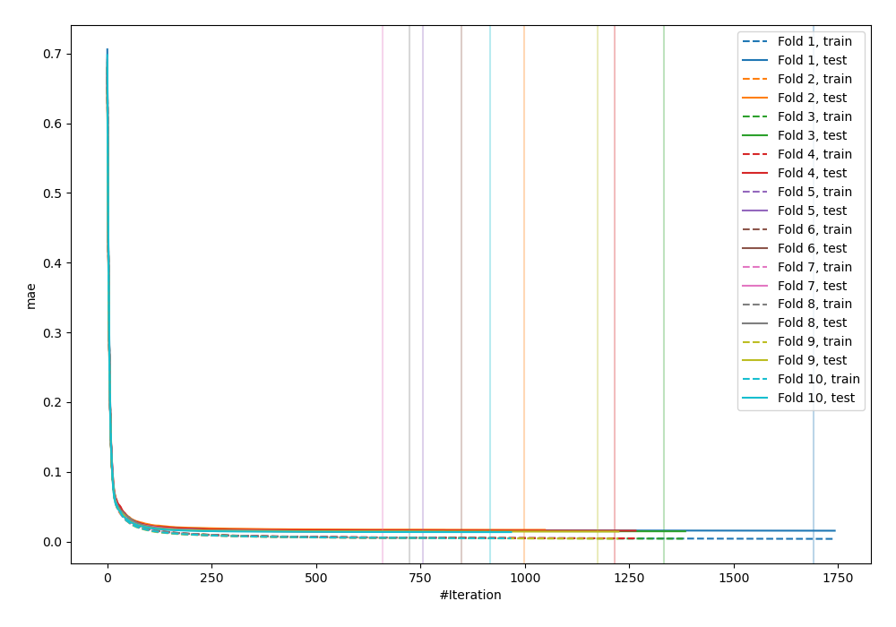
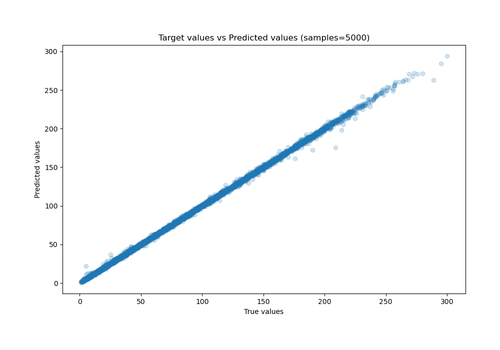
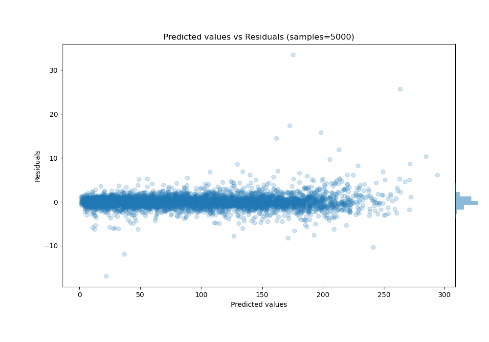

# Summary of 32_CatBoost

[<< Go back](../README.md)

## CatBoost
- **n_jobs**: -1
- **learning_rate**: 0.2
- **depth**: 8
- **rsm**: 1.0
- **loss_function**: MAE
- **eval_metric**: MAE
- **explain_level**: 0

## Validation
 - **validation_type**: kfold
 - **shuffle**: True
 - **k_folds**: 10

## Optimized metric
mae

## Training time

50.4 seconds

### Metric details:
| Metric   |     Score |
|:---------|----------:|
| MAE      | 0.926604  |
| MSE      | 2.21138   |
| RMSE     | 1.48707   |
| R2       | 0.99944   |
| MAPE     | 0.0213285 |

## Learning curves

## True vs Predicted

## Predicted vs Residuals

[<< Go back](../README.md)
