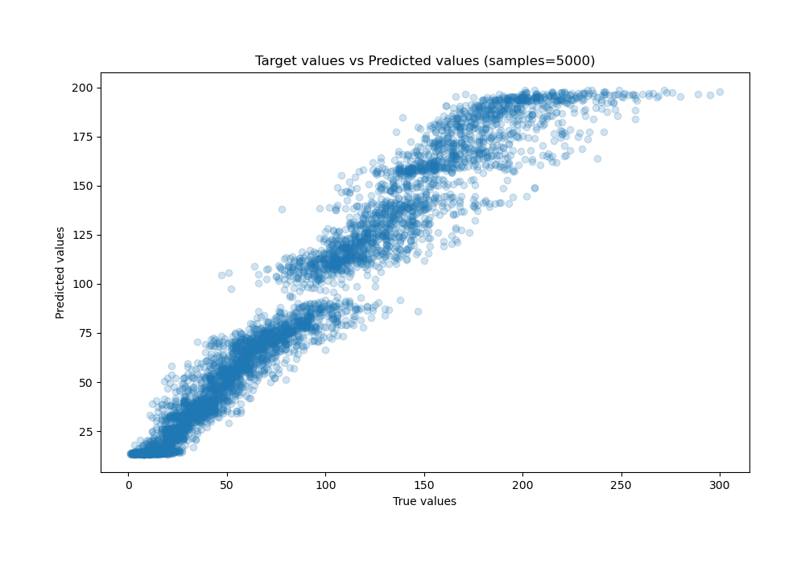
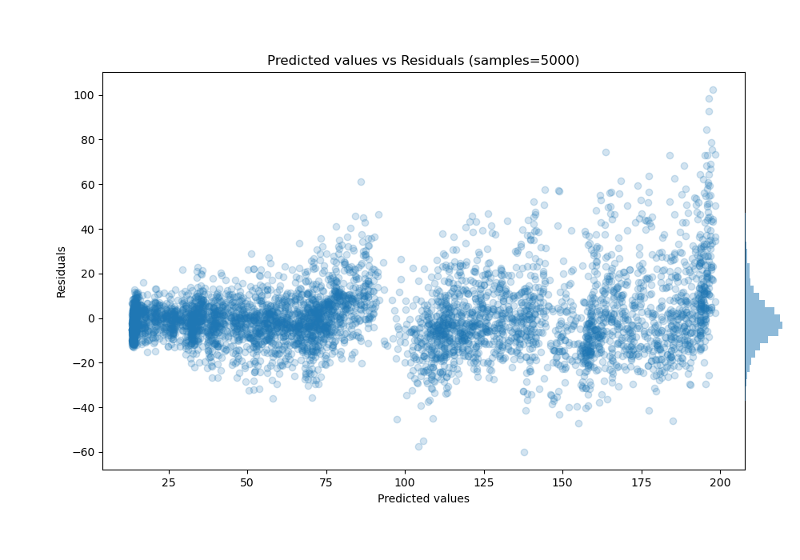

# Summary of 39_RandomForest

[<< Go back](../README.md)

## Random Forest
- **n_jobs**: -1
- **criterion**: squared_error
- **max_features**: 0.7
- **min_samples_split**: 50
- **max_depth**: 3
- **eval_metric_name**: mae
- **explain_level**: 0

## Validation
 - **validation_type**: kfold
 - **shuffle**: True
 - **k_folds**: 10

## Optimized metric
mae

## Training time

18.7 seconds

### Metric details:
| Metric   |      Score |
|:---------|-----------:|
| MAE      |  10.2504   |
| MSE      | 215.842    |
| RMSE     |  14.6916   |
| R2       |   0.945293 |
| MAPE     |   0.244334 |

## Learning curves

## True vs Predicted

## Predicted vs Residuals

[<< Go back](../README.md)
