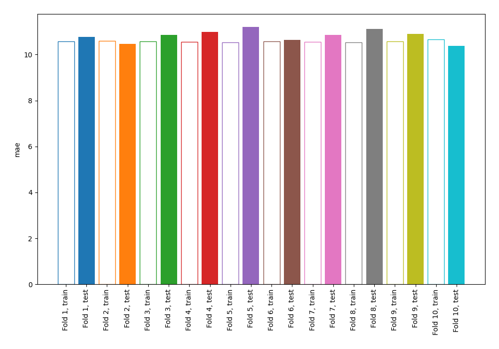
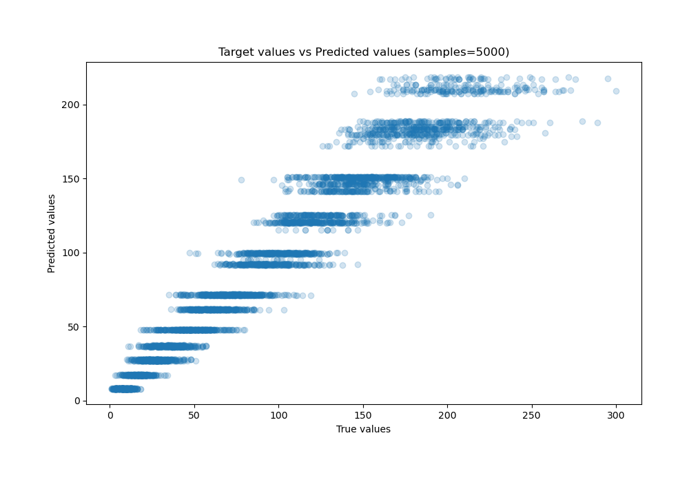
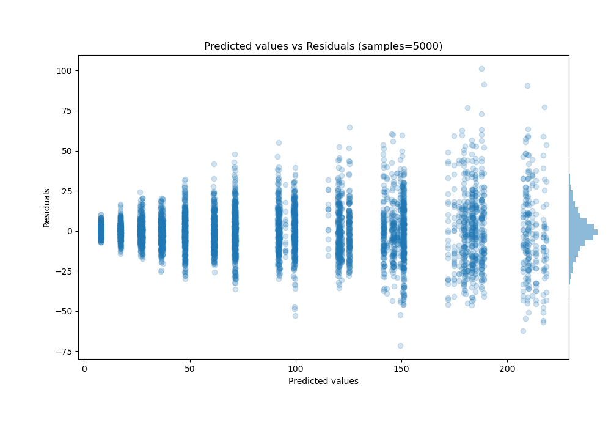

# Summary of 3_DecisionTree

[<< Go back](../README.md)

## Decision Tree
- **n_jobs**: -1
- **criterion**: squared_error
- **max_depth**: 4
- **explain_level**: 0

## Validation
 - **validation_type**: kfold
 - **shuffle**: True
 - **k_folds**: 10

## Optimized metric
mae

## Training time

2.9 seconds

### Metric details:
| Metric   |      Score |
|:---------|-----------:|
| MAE      |  10.8186   |
| MSE      | 229.993    |
| RMSE     |  15.1655   |
| R2       |   0.941707 |
| MAPE     |   0.189271 |

## Learning curves

## True vs Predicted

## Predicted vs Residuals

[<< Go back](../README.md)
