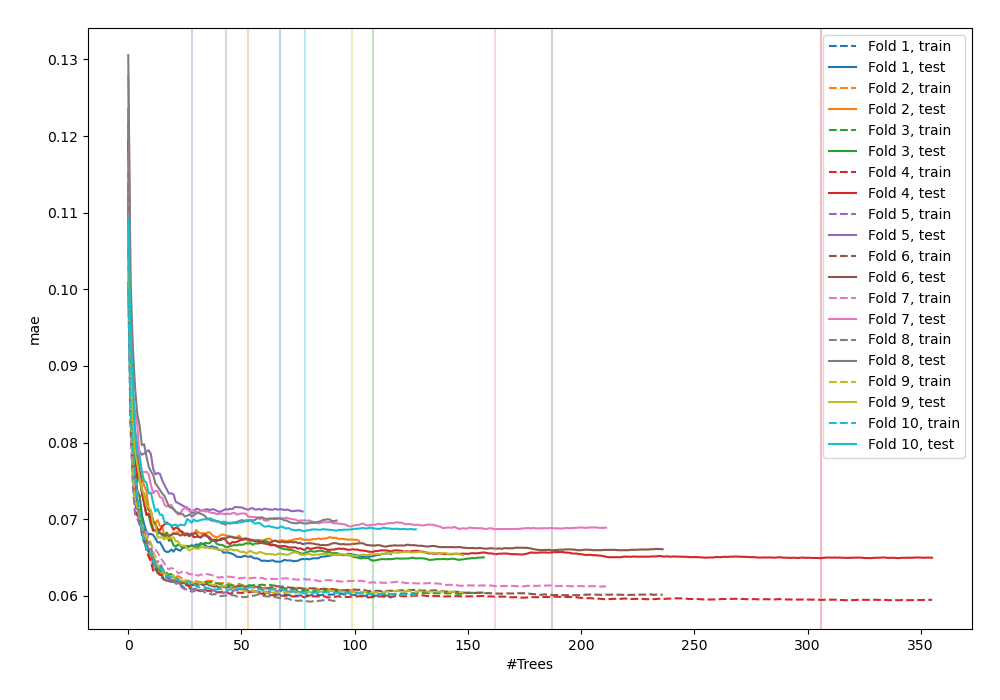
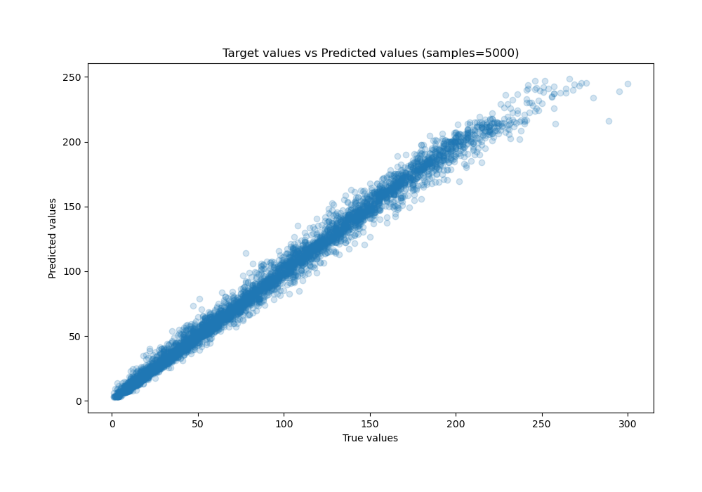
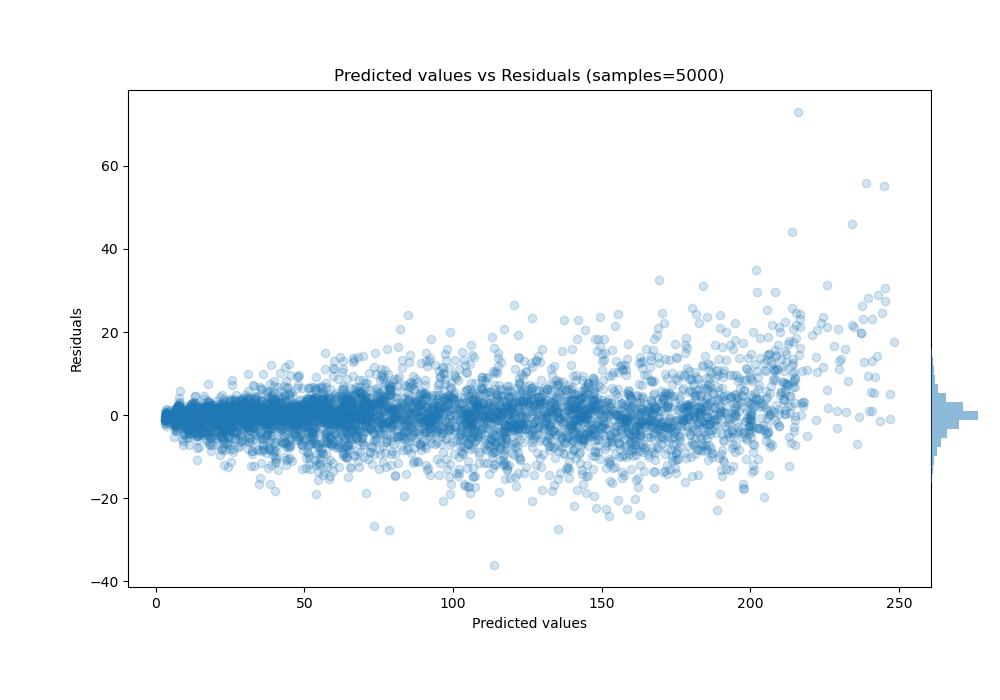

# Summary of 42_RandomForest

[<< Go back](../README.md)

## Random Forest
- **n_jobs**: -1
- **criterion**: squared_error
- **max_features**: 0.7
- **min_samples_split**: 30
- **max_depth**: 7
- **eval_metric_name**: mae
- **explain_level**: 0

## Validation
 - **validation_type**: kfold
 - **shuffle**: True
 - **k_folds**: 10

## Optimized metric
mae

## Training time

27.0 seconds

### Metric details:
| Metric   |     Score |
|:---------|----------:|
| MAE      |  4.20517  |
| MSE      | 40.097    |
| RMSE     |  6.33222  |
| R2       |  0.989837 |
| MAPE     |  0.076952 |

## Learning curves

## True vs Predicted

## Predicted vs Residuals

[<< Go back](../README.md)
