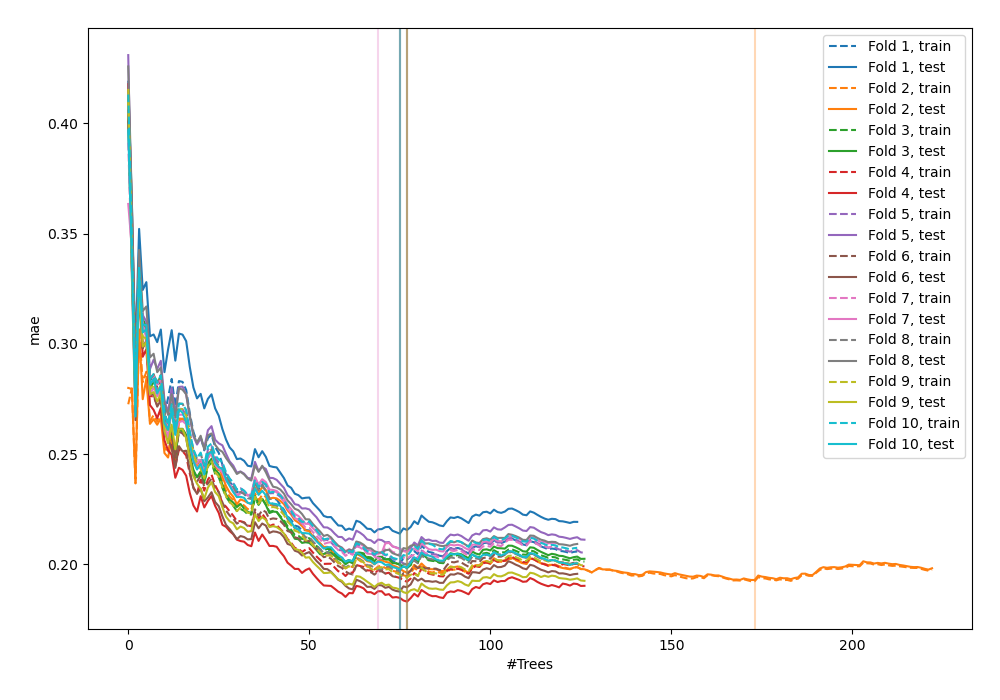
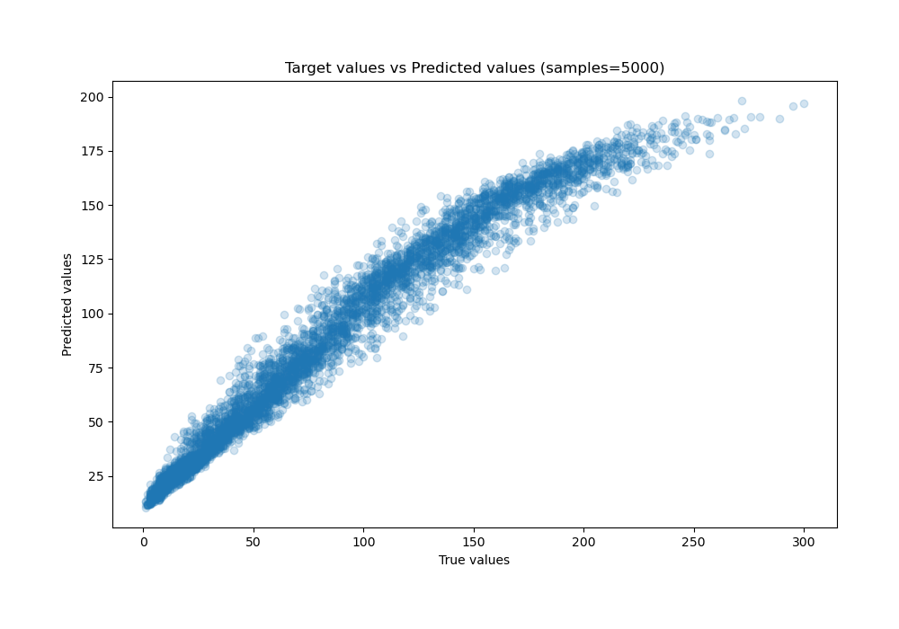
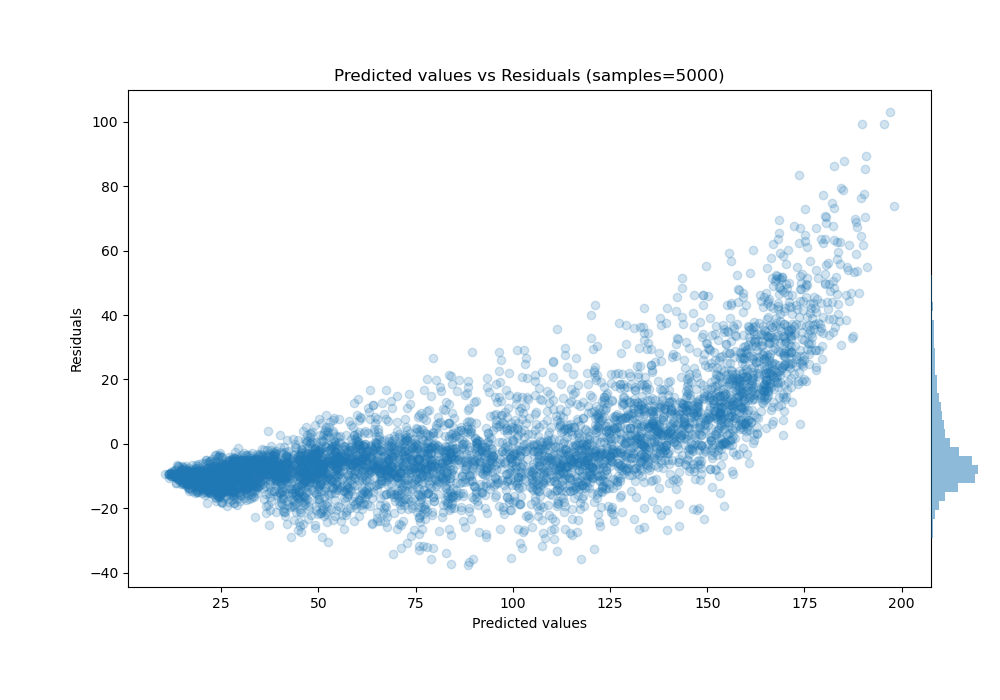

# Summary of 47_ExtraTrees

[<< Go back](../README.md)

## Extra Trees Regressor (Extra Trees)
- **n_jobs**: -1
- **criterion**: squared_error
- **max_features**: 0.5
- **min_samples_split**: 20
- **max_depth**: 4
- **eval_metric_name**: mae
- **explain_level**: 0

## Validation
 - **validation_type**: kfold
 - **shuffle**: True
 - **k_folds**: 10

## Optimized metric
mae

## Training time

20.7 seconds

### Metric details:
| Metric   |      Score |
|:---------|-----------:|
| MAE      |  12.4114   |
| MSE      | 286.55     |
| RMSE     |  16.9278   |
| R2       |   0.927372 |
| MAPE     |   0.341575 |

## Learning curves

## True vs Predicted

## Predicted vs Residuals

[<< Go back](../README.md)
