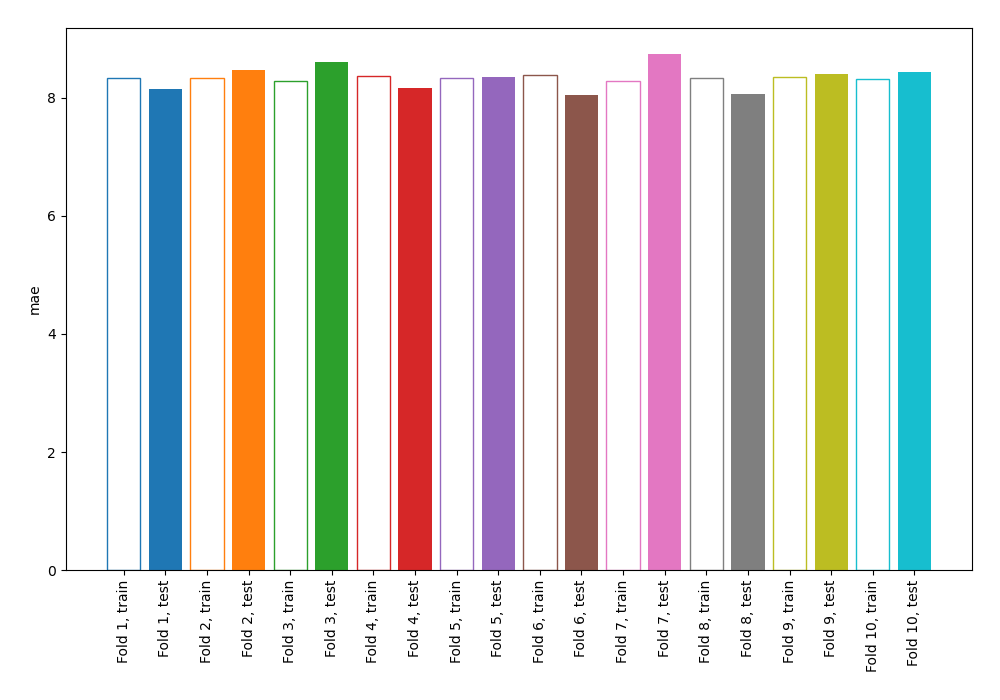
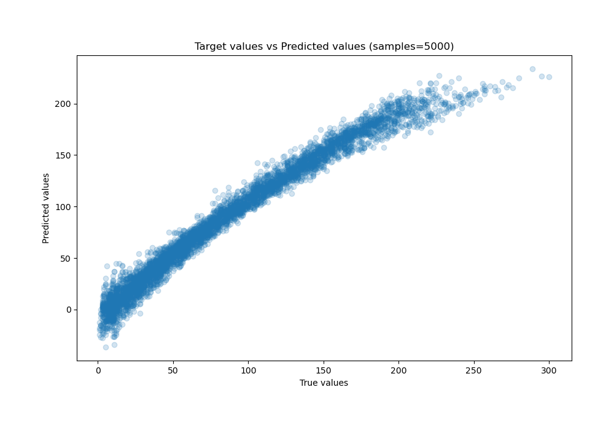
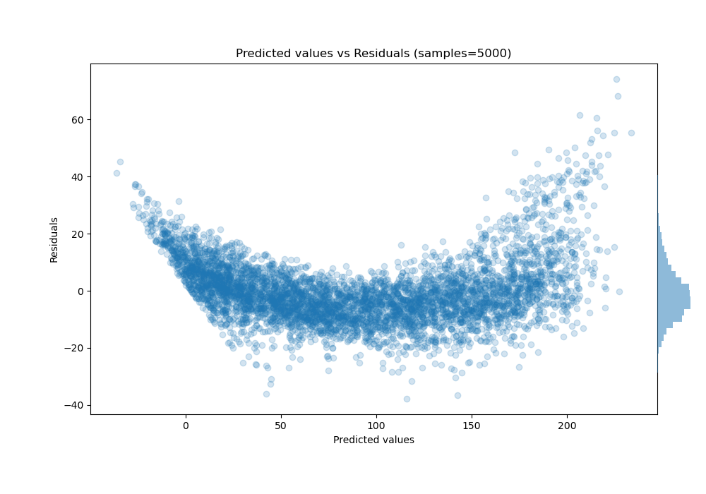

# Summary of 4_Linear

[<< Go back](../README.md)

## Linear Regression (Linear)
- **n_jobs**: -1
- **explain_level**: 0

## Validation
 - **validation_type**: kfold
 - **shuffle**: True
 - **k_folds**: 10

## Optimized metric
mae

## Training time

4.0 seconds

### Metric details:
| Metric   |      Score |
|:---------|-----------:|
| MAE      |   8.33932  |
| MSE      | 127.708    |
| RMSE     |  11.3008   |
| R2       |   0.967632 |
| MAPE     |   0.287658 |

## Learning curves

## True vs Predicted

## Predicted vs Residuals

[<< Go back](../README.md)
