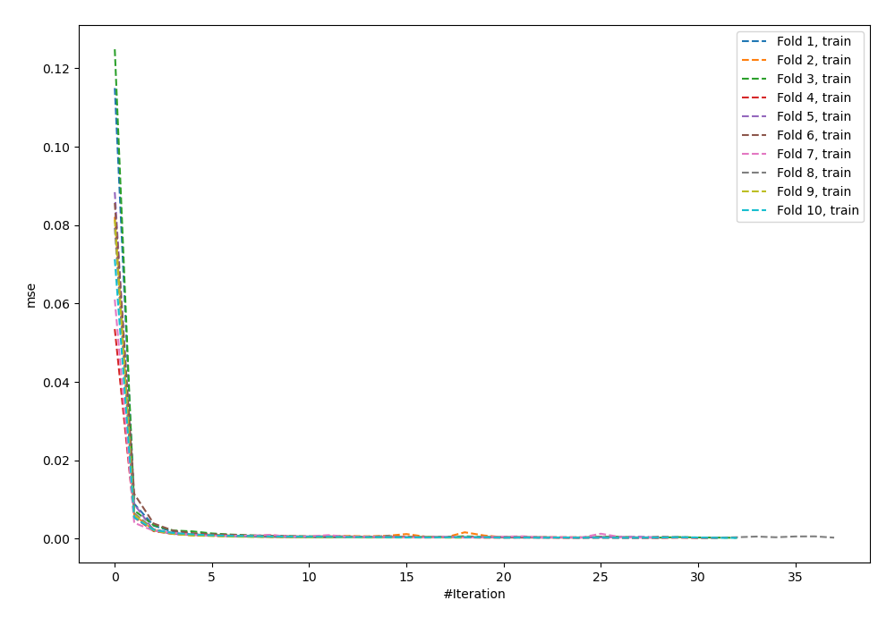
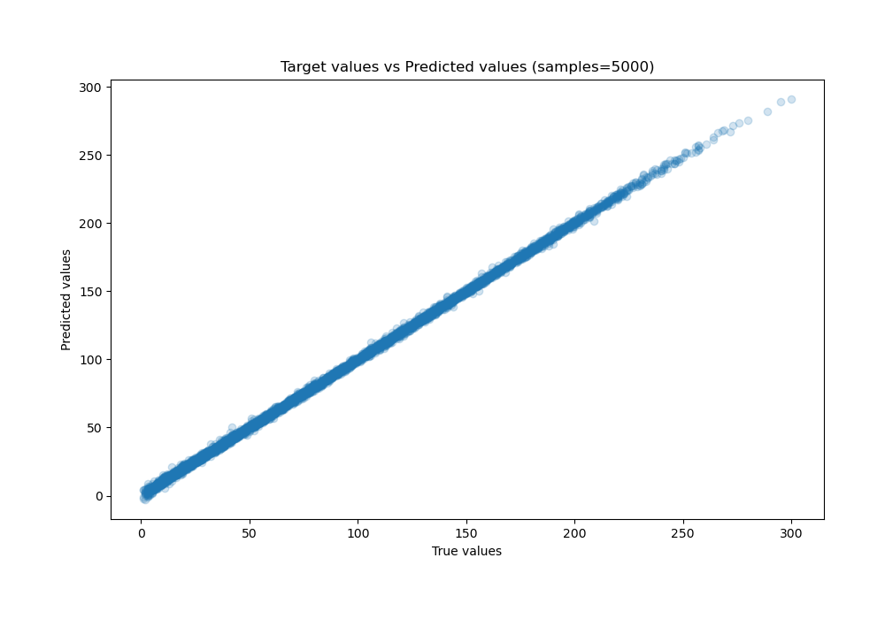
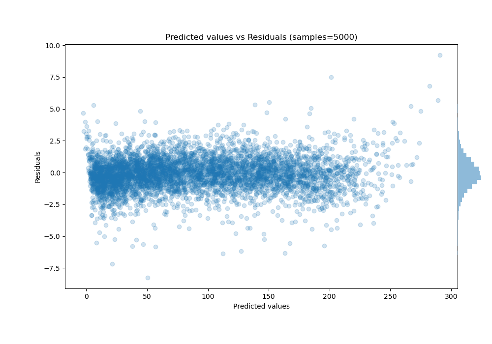

# Summary of 56_NeuralNetwork

[<< Go back](../README.md)

## Neural Network
- **n_jobs**: -1
- **dense_1_size**: 32
- **dense_2_size**: 4
- **learning_rate**: 0.05
- **explain_level**: 0

## Validation
 - **validation_type**: kfold
 - **shuffle**: True
 - **k_folds**: 10

## Optimized metric
mae

## Training time

21.6 seconds

### Metric details:
| Metric   |     Score |
|:---------|----------:|
| MAE      | 0.961288  |
| MSE      | 1.65966   |
| RMSE     | 1.28828   |
| R2       | 0.999579  |
| MAPE     | 0.0330432 |

## Learning curves

## True vs Predicted

## Predicted vs Residuals

[<< Go back](../README.md)
