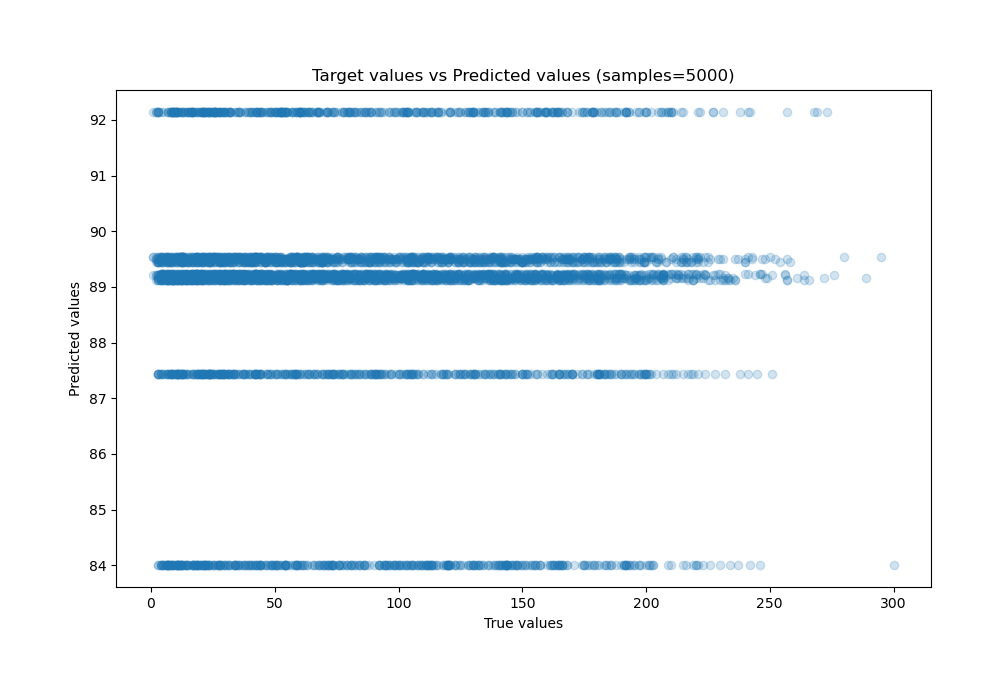
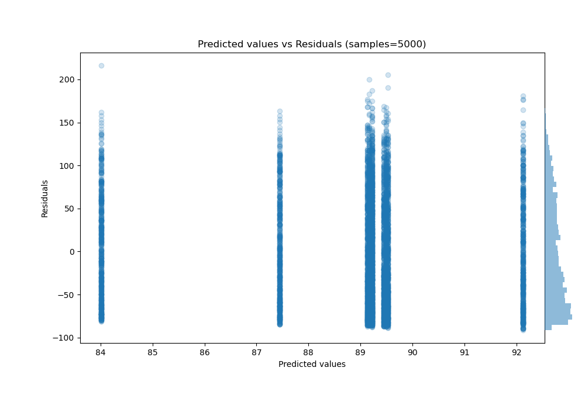

# Summary of 56_NeuralNetwork_Stacked

[<< Go back](../README.md)

## Neural Network
- **n_jobs**: -1
- **dense_1_size**: 32
- **dense_2_size**: 4
- **learning_rate**: 0.05
- **explain_level**: 0

## Validation
 - **validation_type**: kfold
 - **shuffle**: True
 - **k_folds**: 10

## Optimized metric
mae

## Training time

23.0 seconds

### Metric details:
| Metric   |         Score |
|:---------|--------------:|
| MAE      |   53.5898     |
| MSE      | 3949.82       |
| RMSE     |   62.8476     |
| R2       |   -0.00110469 |
| MAPE     |    2.07902    |

## Learning curves

## True vs Predicted

## Predicted vs Residuals

[<< Go back](../README.md)
