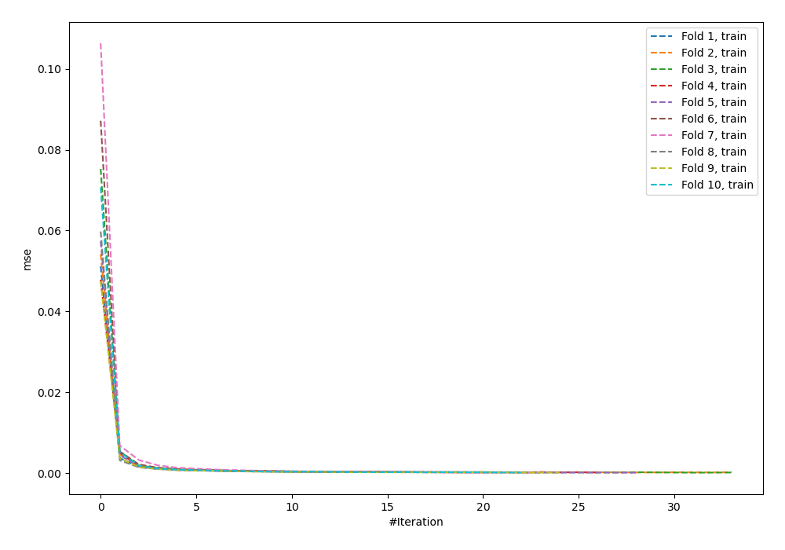
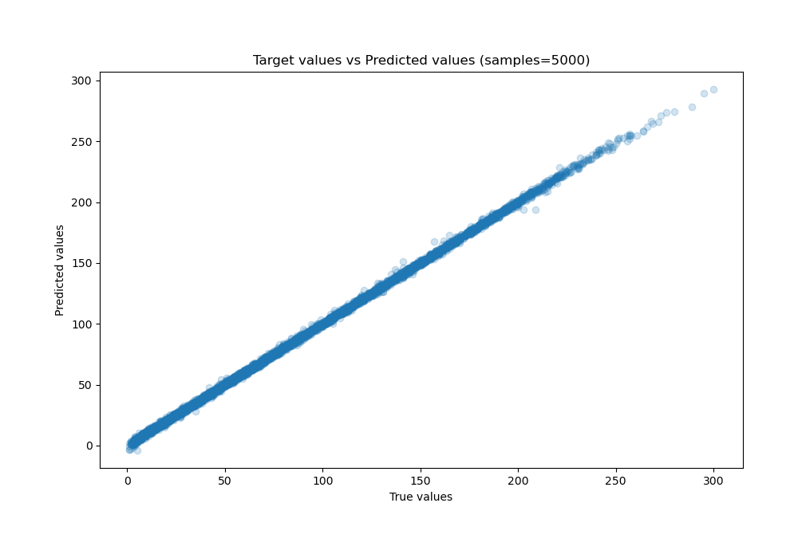
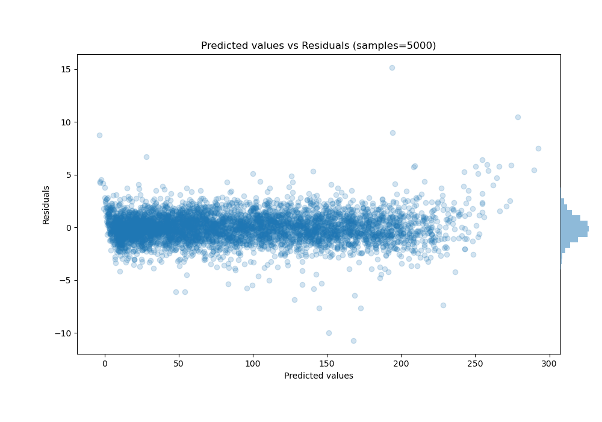

# Summary of 57_NeuralNetwork

[<< Go back](../README.md)

## Neural Network
- **n_jobs**: -1
- **dense_1_size**: 64
- **dense_2_size**: 16
- **learning_rate**: 0.01
- **explain_level**: 0

## Validation
 - **validation_type**: kfold
 - **shuffle**: True
 - **k_folds**: 10

## Optimized metric
mae

## Training time

18.6 seconds

### Metric details:
| Metric   |    Score |
|:---------|---------:|
| MAE      | 0.996971 |
| MSE      | 1.92022  |
| RMSE     | 1.38572  |
| R2       | 0.999513 |
| MAPE     | 0.032064 |

## Learning curves

## True vs Predicted

## Predicted vs Residuals

[<< Go back](../README.md)
