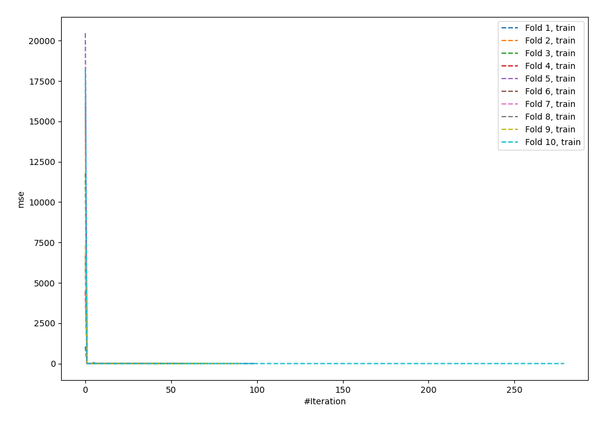
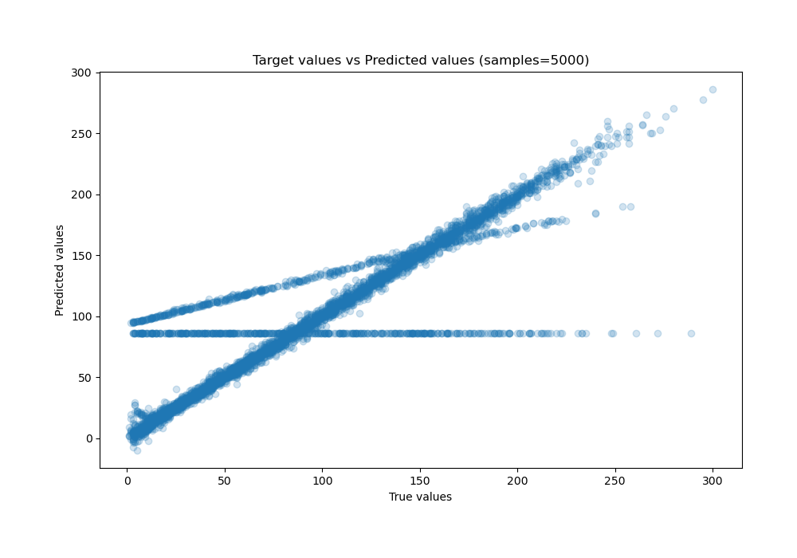
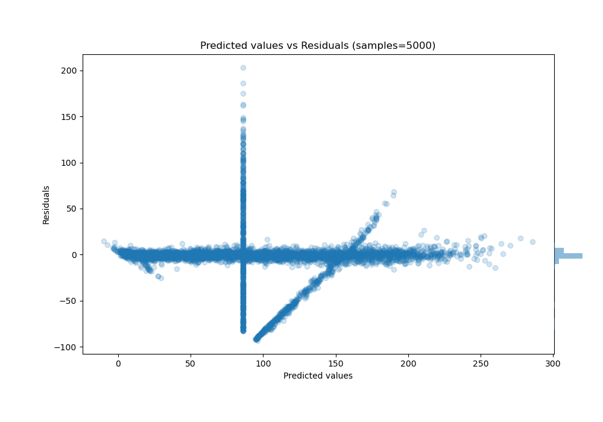

# Summary of 59_NeuralNetwork_Stacked

[<< Go back](../README.md)

## Neural Network
- **n_jobs**: -1
- **dense_1_size**: 32
- **dense_2_size**: 32
- **learning_rate**: 0.05
- **explain_level**: 0

## Validation
 - **validation_type**: kfold
 - **shuffle**: True
 - **k_folds**: 10

## Optimized metric
mae

## Training time

45.1 seconds

### Metric details:
| Metric   |      Score |
|:---------|-----------:|
| MAE      |  12.0272   |
| MSE      | 685.19     |
| RMSE     |  26.1761   |
| R2       |   0.826335 |
| MAPE     |   0.49903  |

## Learning curves

## True vs Predicted

## Predicted vs Residuals

[<< Go back](../README.md)
