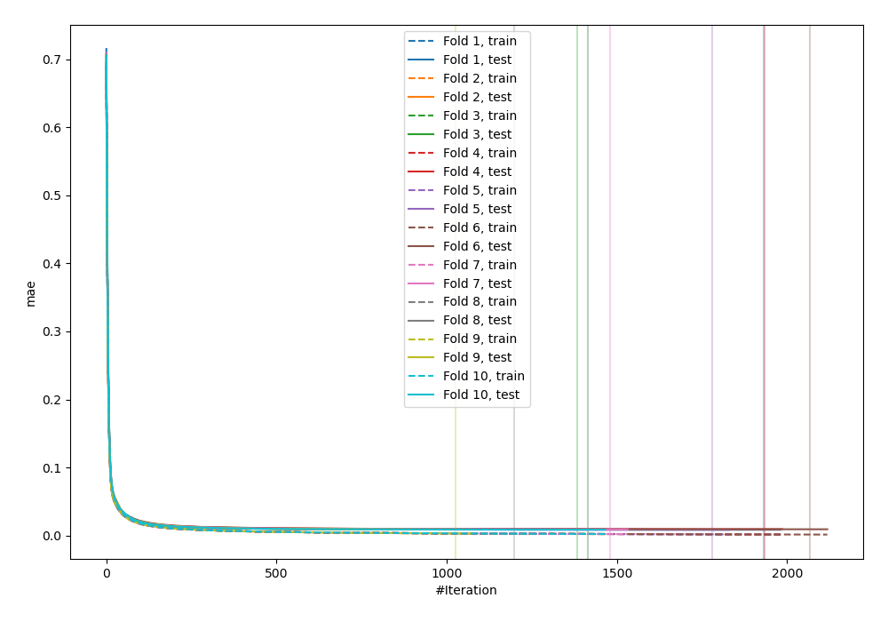
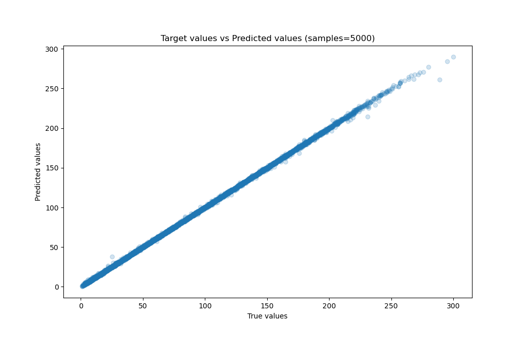
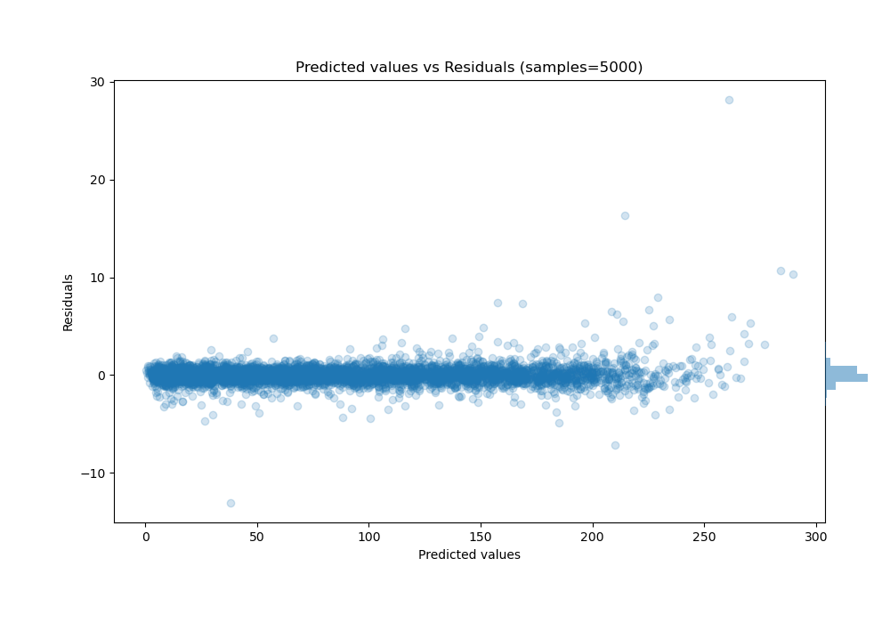

# Summary of 64_CatBoost

[<< Go back](../README.md)

## CatBoost
- **n_jobs**: -1
- **learning_rate**: 0.2
- **depth**: 7
- **rsm**: 1.0
- **loss_function**: RMSE
- **eval_metric**: MAE
- **explain_level**: 0

## Validation
 - **validation_type**: kfold
 - **shuffle**: True
 - **k_folds**: 10

## Optimized metric
mae

## Training time

60.9 seconds

### Metric details:
| Metric   |     Score |
|:---------|----------:|
| MAE      | 0.57253   |
| MSE      | 0.888896  |
| RMSE     | 0.942813  |
| R2       | 0.999775  |
| MAPE     | 0.0149877 |

## Learning curves

## True vs Predicted

## Predicted vs Residuals

[<< Go back](../README.md)
