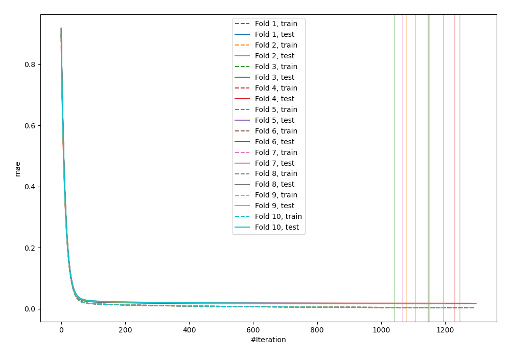
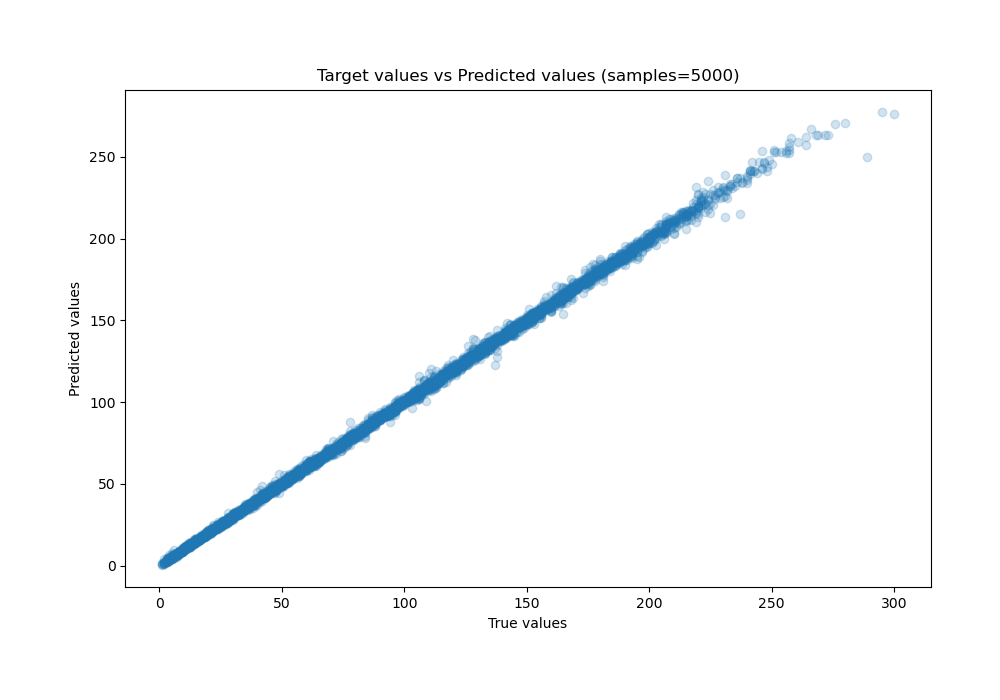
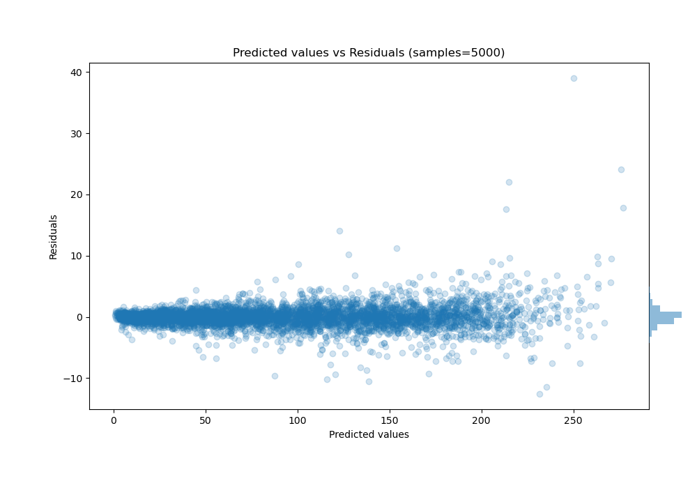

# Summary of 6_Default_Xgboost

[<< Go back](../README.md)

## Extreme Gradient Boosting (Xgboost)
- **n_jobs**: -1
- **objective**: reg:squarederror
- **eta**: 0.075
- **max_depth**: 6
- **min_child_weight**: 1
- **subsample**: 1.0
- **colsample_bytree**: 1.0
- **eval_metric**: mae
- **explain_level**: 0

## Validation
 - **validation_type**: kfold
 - **shuffle**: True
 - **k_folds**: 10

## Optimized metric
mae

## Training time

34.7 seconds

### Metric details:
| Metric   |     Score |
|:---------|----------:|
| MAE      | 1.07374   |
| MSE      | 3.0732    |
| RMSE     | 1.75305   |
| R2       | 0.999221  |
| MAPE     | 0.0188215 |

## Learning curves

## True vs Predicted

## Predicted vs Residuals

[<< Go back](../README.md)
