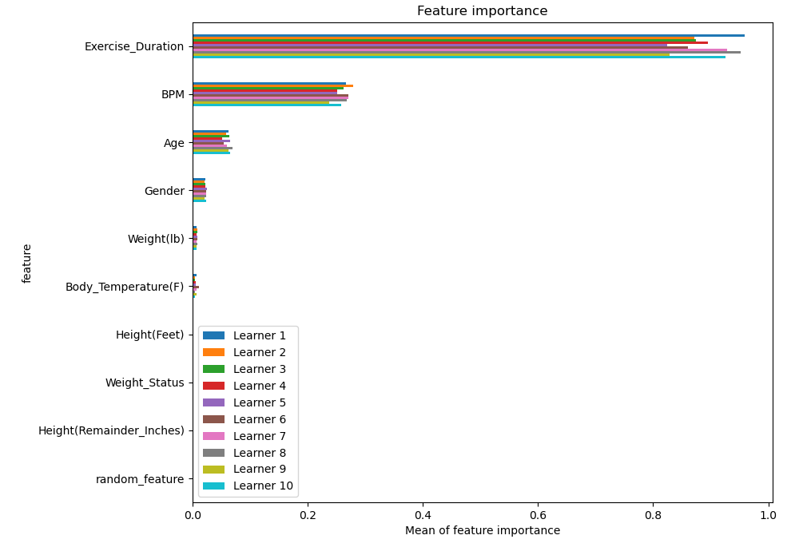
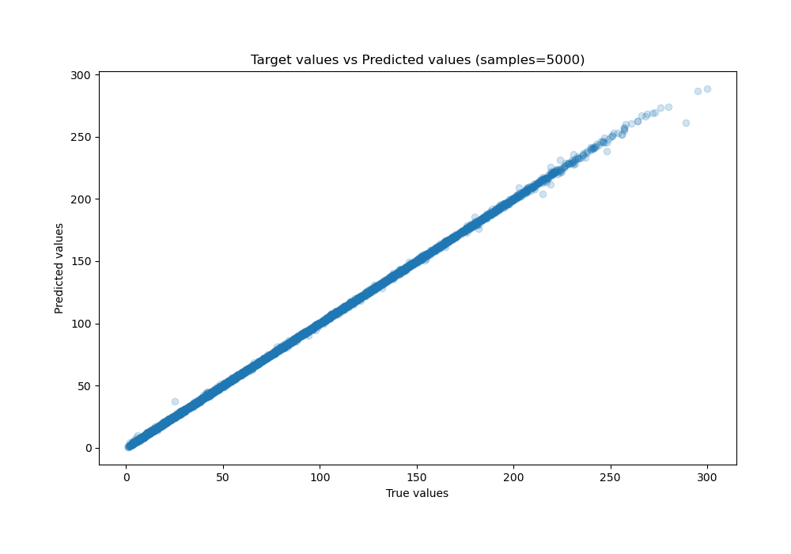
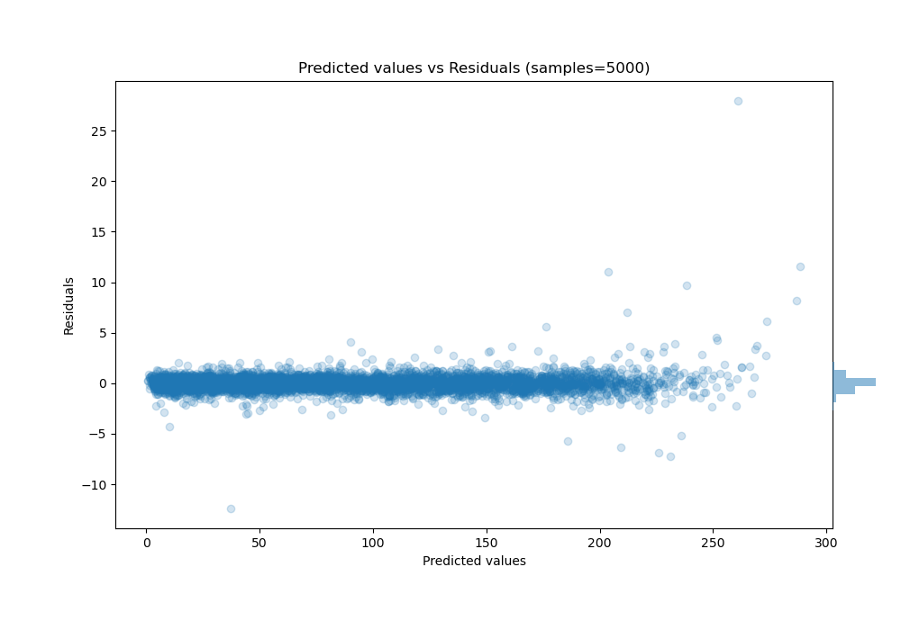

# Summary of 7_Default_CatBoost_RandomFeature

[<< Go back](../README.md)

## CatBoost
- **n_jobs**: -1
- **learning_rate**: 0.1
- **depth**: 6
- **rsm**: 1
- **loss_function**: RMSE
- **eval_metric**: MAE
- **explain_level**: 1

## Validation
 - **validation_type**: kfold
 - **shuffle**: True
 - **k_folds**: 10

## Optimized metric
mae

## Training time

95.3 seconds

### Metric details:
| Metric   |     Score |
|:---------|----------:|
| MAE      | 0.511883  |
| MSE      | 0.698329  |
| RMSE     | 0.835661  |
| R2       | 0.999823  |
| MAPE     | 0.0132906 |

## Learning curves

## Permutation-based Importance

## True vs Predicted

## Predicted vs Residuals

[<< Go back](../README.md)
