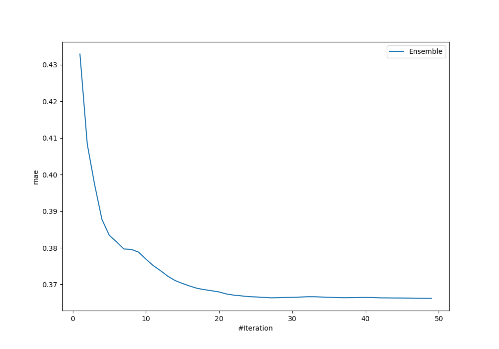
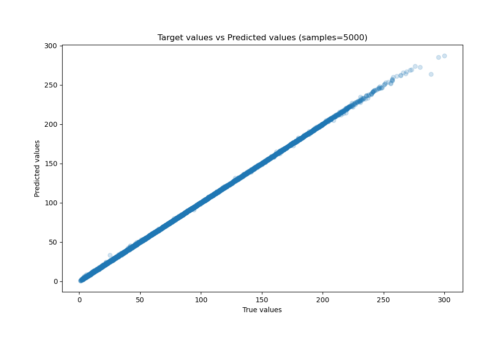
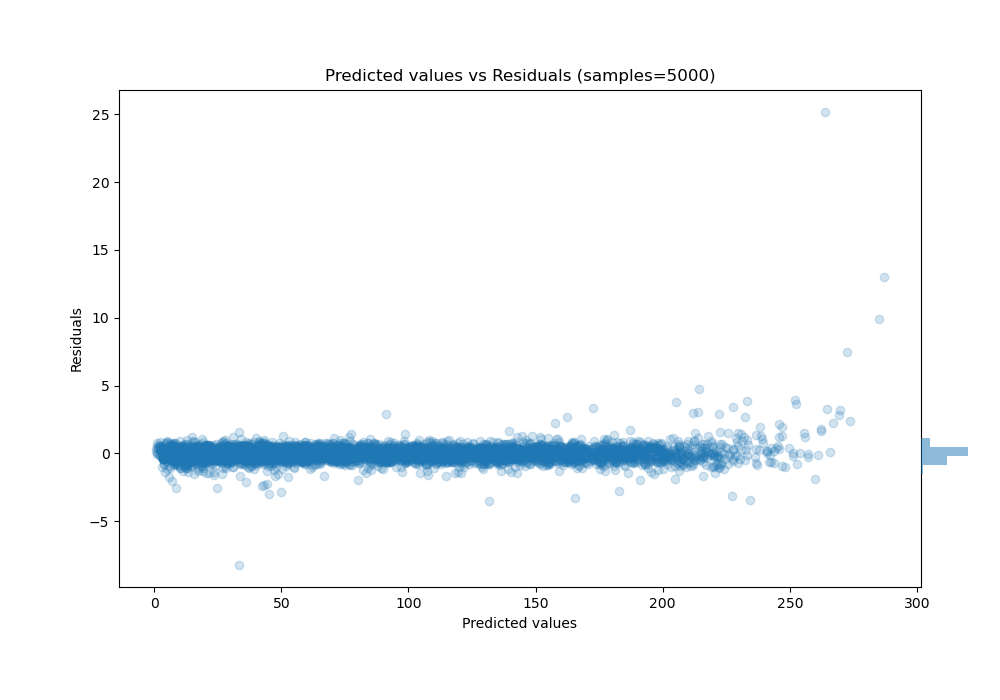

# Summary of Ensemble

[<< Go back](../README.md)

## Ensemble structure
| Model                             |   Weight |
|:----------------------------------|---------:|
| 30_CatBoost                       |        1 |
| 31_CatBoost                       |        3 |
| 33_CatBoost                       |        2 |
| 56_NeuralNetwork                  |        2 |
| 57_NeuralNetwork                  |        2 |
| 59_NeuralNetwork                  |        1 |
| 60_NeuralNetwork                  |        2 |
| 61_CatBoost                       |        8 |
| 61_CatBoost_BoostOnErrors         |        5 |
| 62_CatBoost                       |        4 |
| 63_CatBoost                       |        4 |
| 64_CatBoost                       |        3 |
| 7_Default_CatBoost                |        5 |
| 7_Default_CatBoost_GoldenFeatures |        7 |

### Metric details:
| Metric   |     Score |
|:---------|----------:|
| MAE      | 0.366187  |
| MSE      | 0.388482  |
| RMSE     | 0.623284  |
| R2       | 0.999902  |
| MAPE     | 0.0104993 |

## Learning curves

## True vs Predicted

## Predicted vs Residuals

[<< Go back](../README.md)
