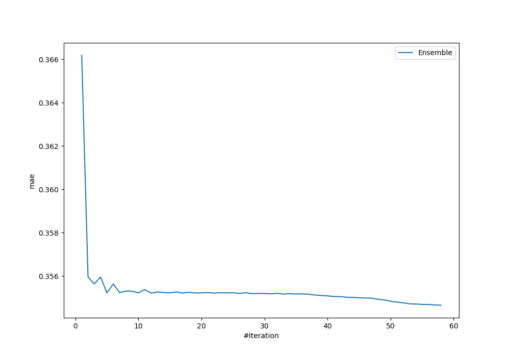
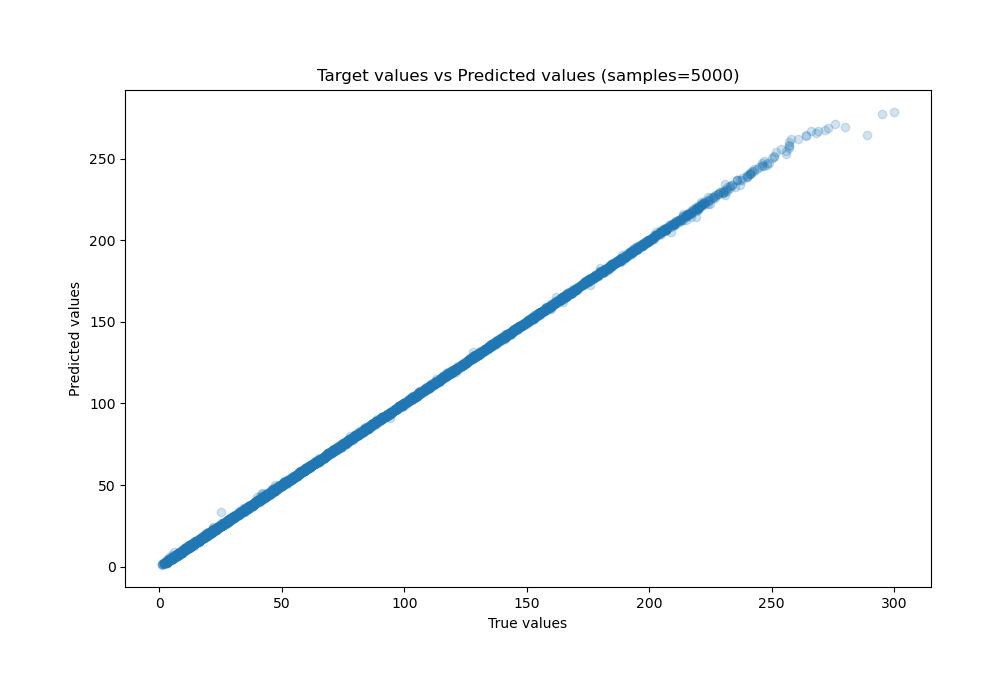
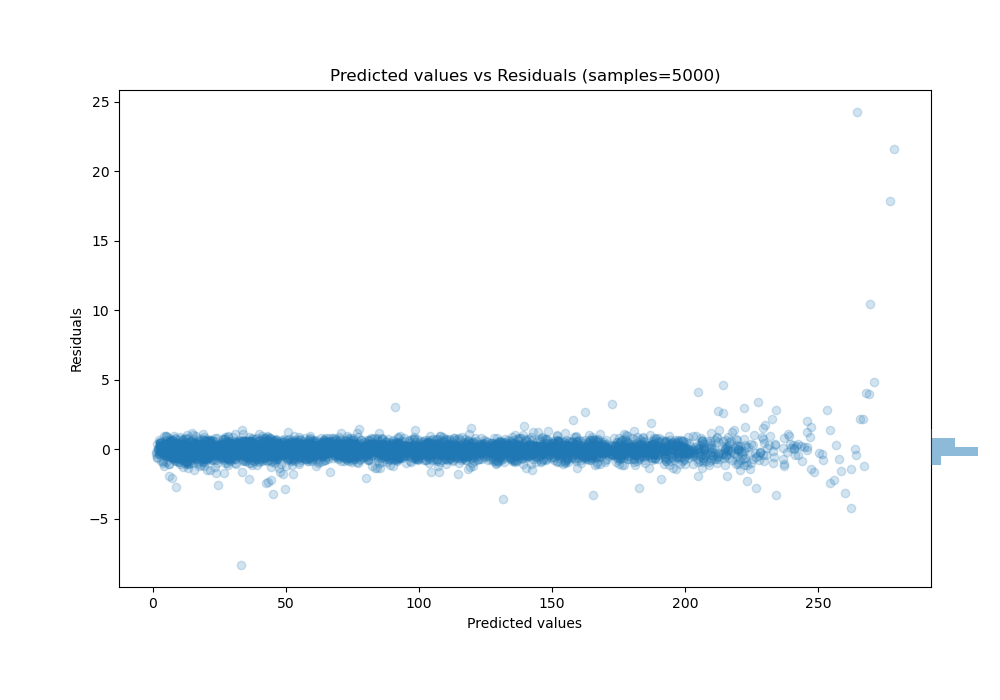

# Summary of Ensemble_Stacked

[<< Go back](../README.md)

## Ensemble structure
| Model                             |   Weight |
|:----------------------------------|---------:|
| 33_CatBoost                       |        1 |
| 42_RandomForest_Stacked           |       23 |
| 57_NeuralNetwork                  |        1 |
| 59_NeuralNetwork                  |        1 |
| 5_Default_LightGBM_Stacked        |        1 |
| 60_NeuralNetwork                  |        1 |
| 7_Default_CatBoost                |        1 |
| 7_Default_CatBoost_GoldenFeatures |        1 |
| Ensemble                          |       28 |

### Metric details:
| Metric   |      Score |
|:---------|-----------:|
| MAE      | 0.354646   |
| MSE      | 0.459855   |
| RMSE     | 0.678126   |
| R2       | 0.999883   |
| MAPE     | 0.00961764 |

## Learning curves

## True vs Predicted

## Predicted vs Residuals

[<< Go back](../README.md)
