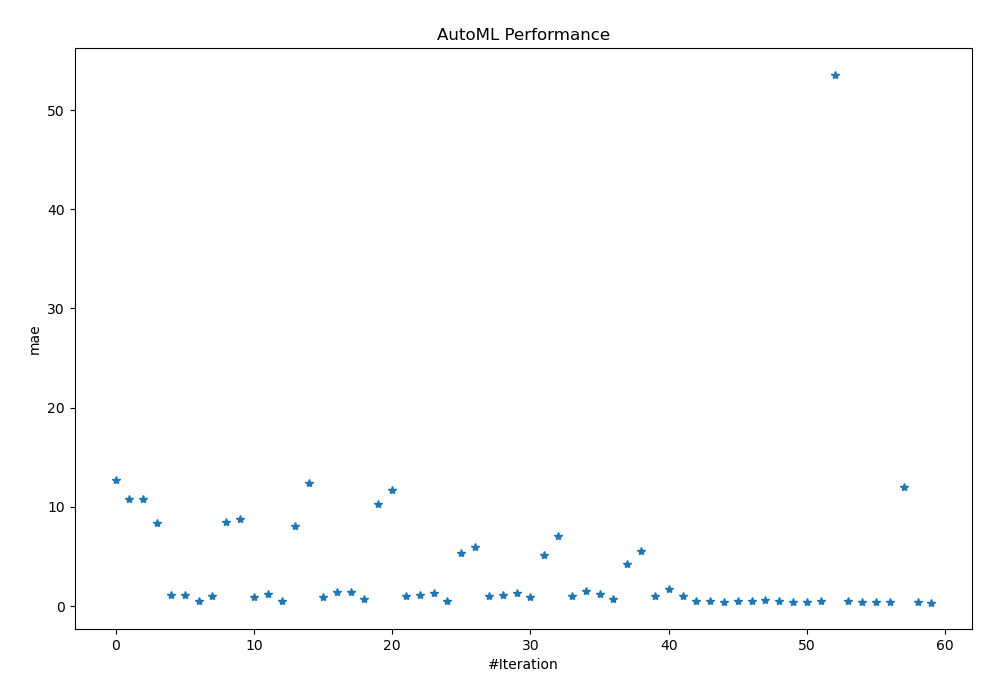
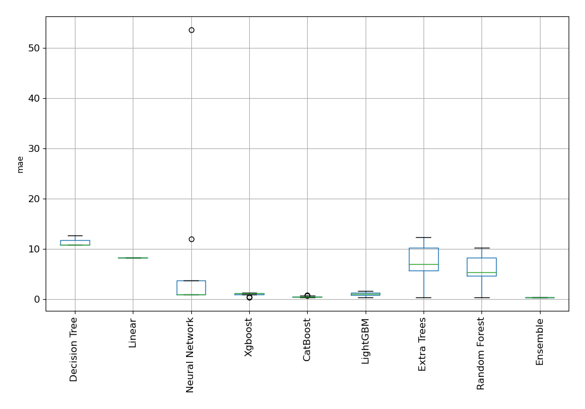
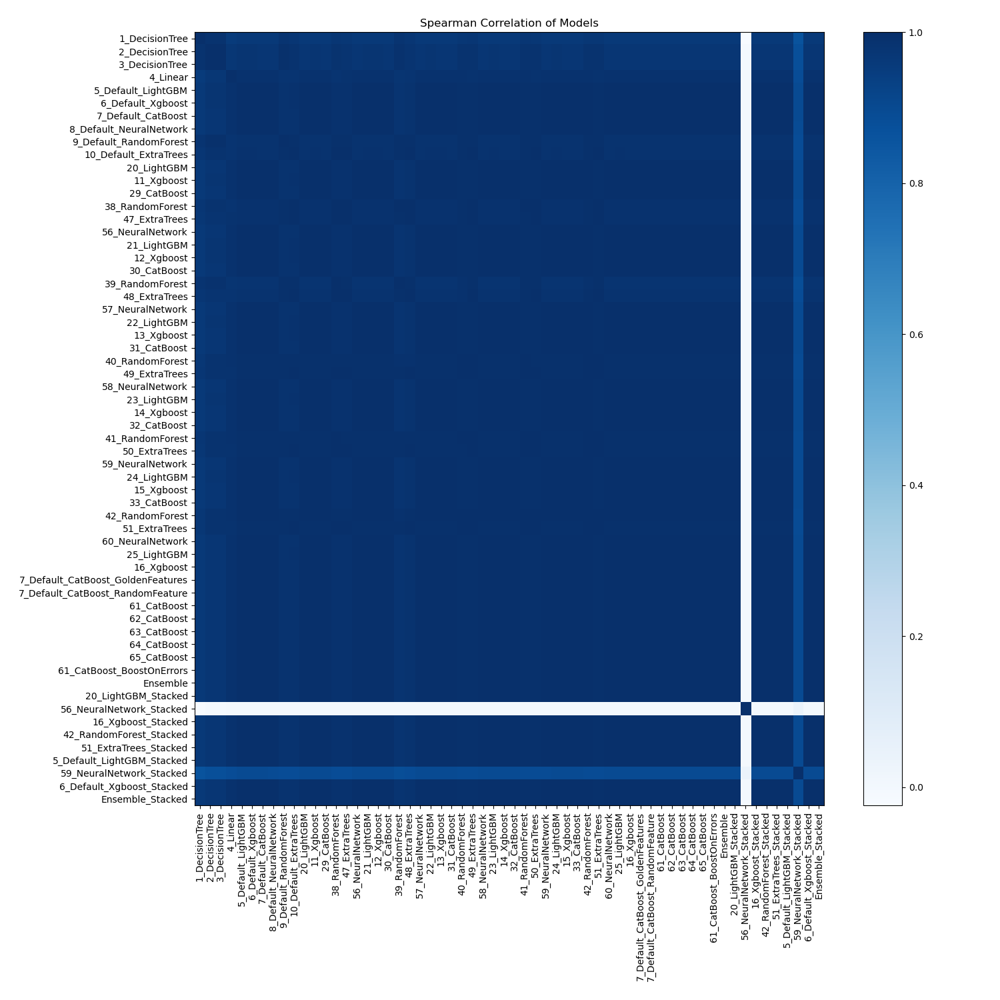

# AutoML Leaderboard

| Best model   | name                                                                             | model_type     | metric_type   |   metric_value |   train_time |
|:-------------|:---------------------------------------------------------------------------------|:---------------|:--------------|---------------:|-------------:|
|              | [1_DecisionTree](1_DecisionTree/README.md)                                       | Decision Tree  | mae           |      12.7463   |         4.18 |
|              | [2_DecisionTree](2_DecisionTree/README.md)                                       | Decision Tree  | mae           |      10.8186   |         3.58 |
|              | [3_DecisionTree](3_DecisionTree/README.md)                                       | Decision Tree  | mae           |      10.8186   |         3.83 |
|              | [4_Linear](4_Linear/README.md)                                                   | Linear         | mae           |       8.33932  |         5.08 |
|              | [5_Default_LightGBM](5_Default_LightGBM/README.md)                               | LightGBM       | mae           |       1.08419  |        69.78 |
|              | [6_Default_Xgboost](6_Default_Xgboost/README.md)                                 | Xgboost        | mae           |       1.07374  |        36.15 |
|              | [7_Default_CatBoost](7_Default_CatBoost/README.md)                               | CatBoost       | mae           |       0.469668 |        83.91 |
|              | [8_Default_NeuralNetwork](8_Default_NeuralNetwork/README.md)                     | Neural Network | mae           |       1.04649  |        13.29 |
|              | [9_Default_RandomForest](9_Default_RandomForest/README.md)                       | Random Forest  | mae           |       8.50362  |        15.68 |
|              | [10_Default_ExtraTrees](10_Default_ExtraTrees/README.md)                         | Extra Trees    | mae           |       8.81138  |        15.42 |
|              | [20_LightGBM](20_LightGBM/README.md)                                             | LightGBM       | mae           |       0.912395 |        42.73 |
|              | [11_Xgboost](11_Xgboost/README.md)                                               | Xgboost        | mae           |       1.26073  |        43.44 |
|              | [29_CatBoost](29_CatBoost/README.md)                                             | CatBoost       | mae           |       0.517783 |       230.51 |
|              | [38_RandomForest](38_RandomForest/README.md)                                     | Random Forest  | mae           |       8.08154  |        19.48 |
|              | [47_ExtraTrees](47_ExtraTrees/README.md)                                         | Extra Trees    | mae           |      12.4114   |        22.07 |
|              | [56_NeuralNetwork](56_NeuralNetwork/README.md)                                   | Neural Network | mae           |       0.961288 |        22.69 |
|              | [21_LightGBM](21_LightGBM/README.md)                                             | LightGBM       | mae           |       1.38456  |        47.62 |
|              | [12_Xgboost](12_Xgboost/README.md)                                               | Xgboost        | mae           |       1.37122  |        17.39 |
|              | [30_CatBoost](30_CatBoost/README.md)                                             | CatBoost       | mae           |       0.754979 |        83.79 |
|              | [39_RandomForest](39_RandomForest/README.md)                                     | Random Forest  | mae           |      10.2504   |        19.73 |
|              | [48_ExtraTrees](48_ExtraTrees/README.md)                                         | Extra Trees    | mae           |      11.7511   |        10.63 |
|              | [57_NeuralNetwork](57_NeuralNetwork/README.md)                                   | Neural Network | mae           |       0.996971 |        19.4  |
|              | [22_LightGBM](22_LightGBM/README.md)                                             | LightGBM       | mae           |       1.1003   |        33.03 |
|              | [13_Xgboost](13_Xgboost/README.md)                                               | Xgboost        | mae           |       1.28184  |        76.34 |
|              | [31_CatBoost](31_CatBoost/README.md)                                             | CatBoost       | mae           |       0.49707  |        94.17 |
|              | [40_RandomForest](40_RandomForest/README.md)                                     | Random Forest  | mae           |       5.3678   |        21.02 |
|              | [49_ExtraTrees](49_ExtraTrees/README.md)                                         | Extra Trees    | mae           |       5.99959  |        23.33 |
|              | [58_NeuralNetwork](58_NeuralNetwork/README.md)                                   | Neural Network | mae           |       1.05058  |        22.25 |
|              | [23_LightGBM](23_LightGBM/README.md)                                             | LightGBM       | mae           |       1.16     |        64.67 |
|              | [14_Xgboost](14_Xgboost/README.md)                                               | Xgboost        | mae           |       1.27273  |        28.15 |
|              | [32_CatBoost](32_CatBoost/README.md)                                             | CatBoost       | mae           |       0.926604 |        51.8  |
|              | [41_RandomForest](41_RandomForest/README.md)                                     | Random Forest  | mae           |       5.18001  |        19.33 |
|              | [50_ExtraTrees](50_ExtraTrees/README.md)                                         | Extra Trees    | mae           |       7.04512  |        32.64 |
|              | [59_NeuralNetwork](59_NeuralNetwork/README.md)                                   | Neural Network | mae           |       0.967697 |        20.26 |
|              | [24_LightGBM](24_LightGBM/README.md)                                             | LightGBM       | mae           |       1.52753  |        35.63 |
|              | [15_Xgboost](15_Xgboost/README.md)                                               | Xgboost        | mae           |       1.21924  |        47.3  |
|              | [33_CatBoost](33_CatBoost/README.md)                                             | CatBoost       | mae           |       0.697862 |       114.98 |
|              | [42_RandomForest](42_RandomForest/README.md)                                     | Random Forest  | mae           |       4.20517  |        28.32 |
|              | [51_ExtraTrees](51_ExtraTrees/README.md)                                         | Extra Trees    | mae           |       5.52015  |        20.18 |
|              | [60_NeuralNetwork](60_NeuralNetwork/README.md)                                   | Neural Network | mae           |       0.982381 |        20.81 |
|              | [25_LightGBM](25_LightGBM/README.md)                                             | LightGBM       | mae           |       1.67031  |       147.07 |
|              | [16_Xgboost](16_Xgboost/README.md)                                               | Xgboost        | mae           |       1.01722  |        65.66 |
|              | [7_Default_CatBoost_GoldenFeatures](7_Default_CatBoost_GoldenFeatures/README.md) | CatBoost       | mae           |       0.524949 |       270.22 |
|              | [7_Default_CatBoost_RandomFeature](7_Default_CatBoost_RandomFeature/README.md)   | CatBoost       | mae           |       0.511883 |        97.76 |
|              | [61_CatBoost](61_CatBoost/README.md)                                             | CatBoost       | mae           |       0.432909 |       155.22 |
|              | [62_CatBoost](62_CatBoost/README.md)                                             | CatBoost       | mae           |       0.534368 |        71.25 |
|              | [63_CatBoost](63_CatBoost/README.md)                                             | CatBoost       | mae           |       0.468115 |       140.66 |
|              | [64_CatBoost](64_CatBoost/README.md)                                             | CatBoost       | mae           |       0.57253  |        62.44 |
|              | [65_CatBoost](65_CatBoost/README.md)                                             | CatBoost       | mae           |       0.475915 |       309.05 |
|              | [61_CatBoost_BoostOnErrors](61_CatBoost_BoostOnErrors/README.md)                 | CatBoost       | mae           |       0.434423 |       135.46 |
|              | [Ensemble](Ensemble/README.md)                                                   | Ensemble       | mae           |       0.366187 |         8.85 |
|              | [20_LightGBM_Stacked](20_LightGBM_Stacked/README.md)                             | LightGBM       | mae           |       0.487791 |        18.42 |
|              | [56_NeuralNetwork_Stacked](56_NeuralNetwork_Stacked/README.md)                   | Neural Network | mae           |      53.5898   |        23.89 |
|              | [16_Xgboost_Stacked](16_Xgboost_Stacked/README.md)                               | Xgboost        | mae           |       0.524129 |        19.35 |
|              | [42_RandomForest_Stacked](42_RandomForest_Stacked/README.md)                     | Random Forest  | mae           |       0.382434 |       134.15 |
|              | [51_ExtraTrees_Stacked](51_ExtraTrees_Stacked/README.md)                         | Extra Trees    | mae           |       0.384492 |        47.44 |
|              | [5_Default_LightGBM_Stacked](5_Default_LightGBM_Stacked/README.md)               | LightGBM       | mae           |       0.428407 |        32.81 |
|              | [59_NeuralNetwork_Stacked](59_NeuralNetwork_Stacked/README.md)                   | Neural Network | mae           |      12.0272   |        45.99 |
|              | [6_Default_Xgboost_Stacked](6_Default_Xgboost_Stacked/README.md)                 | Xgboost        | mae           |       0.440469 |        26.22 |
| **the best** | [Ensemble_Stacked](Ensemble_Stacked/README.md)                                   | Ensemble       | mae           |       0.354646 |        14.05 |

### AutoML Performance

### AutoML Performance Boxplot

### Spearman Correlation of Models

